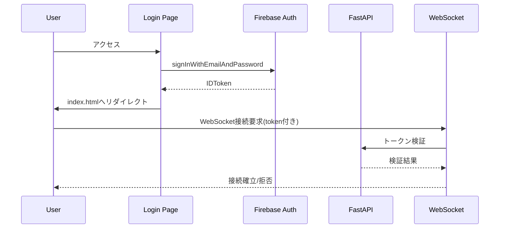

# 実装計画書: Shareholder Portal Login機能

## 計画作成日時
- 日付: 2026年2月9日
- ブランチ: feature/shareholder-login
- 前工程: investigate_20260209_1130.md

## 1. 実装概要

### プロジェクト名
Kuroko Realtime - Shareholder Portal Login機能実装

### 目的
株主総会支援システムにFirebase Authenticationを使用した認証機能を実装し、セキュアなアクセス制御を実現する。

### 実装範囲
- Firebase Authenticationによるメール/パスワード認証
- 認証UIの実装（提供されたデザインに準拠）
- WebSocketエンドポイントの保護
- セッション管理機能

### 実装期間
- 見積もり工数: 3-4日
- Phase 1: 2日（基本認証機能）
- Phase 2: 1日（統合とテスト）
- Phase 3: 1日（最適化とドキュメント）

## 2. 実装アーキテクチャ

### システム構成図

```
┌─────────────┐     ┌──────────────┐     ┌──────────────┐
│   Browser   │────▶│  login.html  │────▶│   Firebase   │
│             │     │  (新規作成)   │     │     Auth     │
└─────────────┘     └──────────────┘     └──────────────┘
       │                    │                     │
       │                    ▼                     ▼
       │            ┌──────────────┐     ┌──────────────┐
       └───────────▶│  index.html  │────▶│   FastAPI    │
                    │   (既存)      │     │  WebSocket   │
                    └──────────────┘     └──────────────┘
```

### 認証フロー



## 3. 詳細実装タスク

### Phase 1: フロントエンド基盤構築【優先度: 高】

#### Task 1.1: ログインページ作成
- **ファイル**: `app/static/login.html`
- **内容**:
  - Firebaseスクリプトの読み込み
  - ログインフォーム（Email/Password）
  - デザイン仕様に準拠したレイアウト
- **工数**: 2時間

#### Task 1.2: ログインスタイル実装
- **ファイル**: `app/static/css/login.css`
- **内容**:
  - カードベースのデザイン
  - グラデーション背景
  - レスポンシブ対応
  - 紫色テーマ（#6B46C1）
- **工数**: 2時間

#### Task 1.3: Firebase認証モジュール
- **ファイル**: `app/static/js/firebase-auth.js`
- **内容**:
  ```javascript
  // Firebase初期化
  const firebaseConfig = {
    apiKey: "YOUR_API_KEY",
    authDomain: "YOUR_AUTH_DOMAIN",
    projectId: "YOUR_PROJECT_ID",
    storageBucket: "YOUR_STORAGE_BUCKET",
    messagingSenderId: "YOUR_MESSAGING_SENDER_ID",
    appId: "YOUR_APP_ID"
  };

  // 認証関数
  - signIn(email, password)
  - signOut()
  - resetPassword(email)
  - getCurrentUser()
  - getIdToken()
  ```
- **工数**: 3時間

#### Task 1.4: ログインUI処理
- **ファイル**: `app/static/js/login.js`
- **内容**:
  - フォームバリデーション
  - エラーハンドリング
  - ローディング状態管理
  - リダイレクト処理
- **工数**: 2時間

### Phase 2: バックエンド統合【優先度: 高】

#### Task 2.1: 認証ミドルウェア実装
- **ファイル**: `app/auth/__init__.py`
- **内容**:
  ```python
  from firebase_admin import auth, initialize_app

  class FirebaseAuthMiddleware:
      def verify_token(self, token: str):
          """JWTトークン検証"""
          pass

      def get_user_info(self, uid: str):
          """ユーザー情報取得"""
          pass
  ```
- **工数**: 3時間

#### Task 2.2: main.py修正
- **ファイル**: `app/main.py`
- **変更内容**:
  - ログインページのルーティング追加
  - WebSocketエンドポイントの認証追加
  - トークン検証処理
  - セッション管理の改善
- **工数**: 3時間

#### Task 2.3: 既存JS修正
- **ファイル**: `app/static/js/app.js`
- **変更内容**:
  - 認証状態のチェック
  - トークンをWebSocketに含める
  - 未認証時のリダイレクト
- **工数**: 2時間

### Phase 3: テストと最適化【優先度: 中】

#### Task 3.1: 単体テスト作成
- **ファイル**: `tests/test_auth.py` (新規)
- **テスト項目**:
  - トークン検証
  - ミドルウェア動作
  - エラーハンドリング
- **工数**: 2時間

#### Task 3.2: 統合テスト
- **ファイル**: `tests/test_integration.py` (新規)
- **テスト項目**:
  - エンドツーエンド認証フロー
  - WebSocket接続テスト
  - セッション永続性
- **工数**: 2時間

#### Task 3.3: セキュリティ強化
- **対策**:
  - HTTPS対応確認
  - CORS設定
  - レート制限実装
  - 入力サニタイゼーション
- **工数**: 2時間

## 4. ファイル変更計画

### 新規作成ファイル

| ファイルパス | 目的 | 優先度 |
|-------------|-----|--------|
| `app/static/login.html` | ログインページ | 高 |
| `app/static/css/login.css` | ログインスタイル | 高 |
| `app/static/js/firebase-auth.js` | Firebase認証モジュール | 高 |
| `app/static/js/login.js` | ログインUI処理 | 高 |
| `app/auth/__init__.py` | 認証ミドルウェア | 高 |
| `tests/test_auth.py` | 認証テスト | 中 |
| `tests/test_integration.py` | 統合テスト | 中 |

### 修正ファイル

| ファイルパス | 変更内容 | 影響度 |
|-------------|---------|--------|
| `app/main.py` | ルーティング追加、認証統合 | 高 |
| `app/static/js/app.js` | 認証チェック追加 | 中 |
| `app/static/index.html` | ログアウトボタン追加 | 低 |
| `pyproject.toml` | Firebase依存追加 | 低 |

## 5. テスト戦略

### 単体テスト
- **対象**: 認証モジュール、ミドルウェア
- **ツール**: pytest
- **カバレッジ目標**: 80%以上

### 統合テスト
- **対象**: 認証フロー全体
- **ツール**: FastAPI TestClient
- **シナリオ**:
  1. ログイン成功/失敗
  2. トークン期限切れ
  3. セッション復元

### E2Eテスト
- **対象**: ユーザー操作フロー
- **手動テスト項目**:
  1. ログイン画面表示
  2. 認証処理
  3. リダイレクト動作
  4. WebSocket接続

### セキュリティテスト
- **項目**:
  - SQLインジェクション対策
  - XSS対策
  - CSRF対策
  - ブルートフォース対策

## 6. リスク分析と対策

### 技術的リスク

| リスク | 発生確率 | 影響度 | 対策 |
|--------|---------|--------|------|
| Firebase SDK互換性問題 | 低 | 中 | CDN版使用、バージョン固定 |
| WebSocket認証の複雑性 | 中 | 高 | 段階的実装、十分なテスト |
| 既存機能への影響 | 低 | 高 | 機能フラグ、ロールバック計画 |
| パフォーマンス劣化 | 低 | 中 | 非同期処理、キャッシュ活用 |

### セキュリティリスク

| リスク | 発生確率 | 影響度 | 対策 |
|--------|---------|--------|------|
| トークン漏洩 | 中 | 高 | HTTPS強制、短期トークン |
| 不正アクセス | 中 | 高 | 多層防御、監査ログ |
| DoS攻撃 | 低 | 中 | レート制限、CloudFlare |

### 対策実装優先度
1. **即座に実装**: HTTPS強制、入力検証
2. **Phase 2で実装**: レート制限、監査ログ
3. **将来的に実装**: WAF導入、侵入検知

## 7. 依存関係

### 外部依存
- Firebase Authentication
- firebase-admin SDK (Python)
- Firebase JavaScript SDK

### 内部依存
- 既存のWebSocket実装
- ADK BiDi-streaming機能
- セッション管理システム

### パッケージ追加
```toml
# pyproject.toml に追加
dependencies = [
    "firebase-admin>=6.5.0",
    "pyjwt>=2.8.0",
]
```

## 8. マイルストーン

### Milestone 1: 基本認証機能（Day 1-2）
- [ ] ログインページ作成
- [ ] Firebase SDK統合
- [ ] 基本的な認証フロー

### Milestone 2: システム統合（Day 3）
- [ ] バックエンド認証
- [ ] WebSocket保護
- [ ] セッション管理

### Milestone 3: 品質保証（Day 4）
- [ ] テスト実装
- [ ] セキュリティ対策
- [ ] ドキュメント作成

## 9. 成功基準

### 機能要件
- ✅ メール/パスワードでログイン可能
- ✅ 認証済みユーザーのみWebSocketアクセス可能
- ✅ セッションの永続化
- ✅ パスワードリセット機能

### 非機能要件
- ✅ レスポンス時間: 2秒以内
- ✅ 同時接続数: 100ユーザー以上
- ✅ 可用性: 99.9%
- ✅ セキュリティ: OWASP Top 10対策

## 10. 次のステップ

### 即座に開始すべきタスク
1. **Firebase プロジェクト設定**
   - Authentication有効化
   - メール/パスワード認証を有効化
   - テストユーザー作成

2. **開発環境準備**
   - 依存パッケージインストール
   - Firebase Admin SDK設定
   - 環境変数設定

3. **実装開始**
   - login.html作成
   - Firebase SDK統合

### コマンド例
```bash
# 依存パッケージインストール
pip install firebase-admin pyjwt

# 開発サーバー起動
uvicorn app.main:app --reload

# テスト実行
pytest tests/
```

## 11. 将来の拡張計画

### Phase 4: Voice Interaction（将来）
- 音声によるパスワード入力
- Voice ID認証
- 音声コマンドログイン

### Phase 5: 高度な認証（将来）
- 多要素認証（MFA）
- ソーシャルログイン
- SAML/OAuth統合

### Phase 6: 管理機能（将来）
- ユーザー管理画面
- アクセスログ
- 権限管理（RBAC）

## 12. 結論

本実装計画は、Shareholder Portal Login機能を段階的かつ安全に実装するための詳細な roadmap を提供します。Firebase Authenticationを活用することで、短期間で堅牢な認証システムを構築できます。

実装優先度は以下の通り：
1. **最優先**: 基本認証機能とUI実装
2. **高優先**: WebSocket保護とセッション管理
3. **中優先**: テストとセキュリティ強化
4. **低優先**: ドキュメントと将来拡張

---
計画作成: 2026年2月9日
ブランチ: feature/shareholder-login
次フェーズ: IMPLEMENT（実装開始）